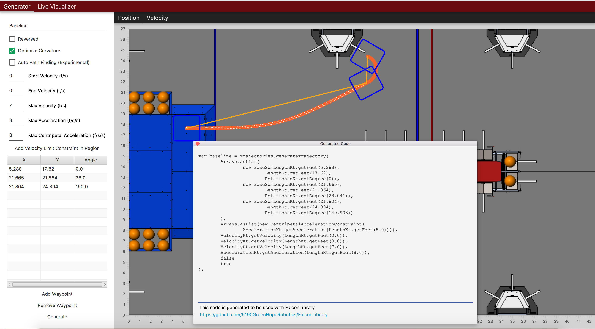

FalconDashboard
================

Falcon Dashboard is a Kotlin-based utility that can be used to generate
trajectories and visualize the robot's position on the field live. This
utility uses FalconLibrary as the backend trajectory generation code,
and generates code that can be pasted into your robot code. The source
code is publicly available at https://github.com/5190GreenHopeRobotics/FalconDashboard

.. image:: images/dash1.png
   :width: 900

.. image:: images/dash2.png
   :width: 900

Running FalconDashboard
--------------------------

Clone or download the repository, and execute this command from within
the project root directory:

    ./gradlew run

Generating code
-----------------

To generate code, just click generate and paste the code into
a command or command group. Specific implementation will vary
user to user. See Following Trajectories (TODO Link) for more
information. One example might be:

.. tabs::

   .. code-tab:: java

        var traject = Trajectories.generateTrajectory(
            Arrays.asList(
                new Pose2d(LengthKt.getFeet(5.634),
                    LengthKt.getFeet(17.719),
                    Rotation2dKt.getDegree(0)),
                new Pose2d(LengthKt.getFeet(18.36),
                    LengthKt.getFeet(19.143),
                    Rotation2dKt.getDegree(0)),
                new Pose2d(LengthKt.getFeet(20.822),
                    LengthKt.getFeet(25.301),
                    Rotation2dKt.getDegree(153.33))
            ),
            Arrays.asList(new CentripetalAccelerationConstraint(
                AccelerationKt.getAcceleration(LengthKt.getFeet(8.0)))),
            VelocityKt.getVelocity(LengthKt.getFeet(0.0)),
            VelocityKt.getVelocity(LengthKt.getFeet(0.0)),
            VelocityKt.getVelocity(LengthKt.getFeet(7.0)),
            AccelerationKt.getAcceleration(LengthKt.getFeet(8.0)),
            false
            true
        );

        addSequential(new FollowPathCommand(traject, true, m_DriveBase);

   .. code-tab:: kotlin

        // coming soon, coz i don't know Kotlin at all

